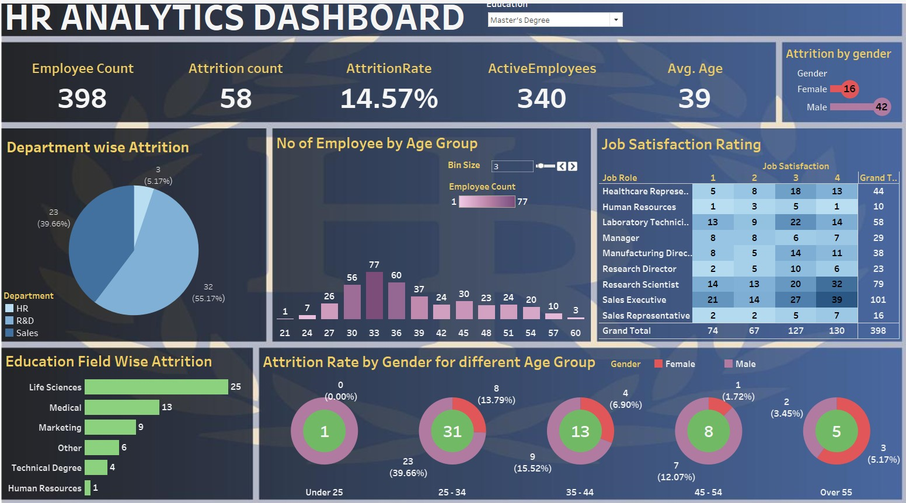

##  HR Dashboard using Tableau
A comprehensive interactive Tableau dashboard that visualizes key human resources metrics to help HR professionals gain meaningful insights and drive data-driven decisions.

## Objectives   
- Analyze employee attrition patterns and identify key factors contributing to turnover.
- Provide insights into workforce demographics and job satisfaction levels.
- Enable HR professionals to make data-driven decisions to improve employee retention.
   
## Tools & Technologies 
| Technology          | Description                                     |
| ------------------- | ----------------------------------------------- |
| **Tableau Desktop** | Dashboard design and interactive visualizations |
| **Microsoft Excel** | Source dataset file (HR data in `.xlsx` format) |
| **GitHub**          | Repository hosting and documentation            |

## 🖥️ Dashboard Preview

## Dashboard Features    
- Attrition Analysis: Visual representation of attrition rates across departments, job roles, and demographics.
- Demographic Insights: Breakdown of employees by age group, gender, and education field.
- Job Satisfaction: Analysis of job satisfaction levels across different roles. 
- Interactive Filters: Allows users to drill down into specific segments for detailed analysis.

## Key Insights 
- Departments with the highest attrition rates.
- Correlations between job satisfaction and employee turnover.
- Demographic groups most affected by attrition.

## How to Use This Dashboard
1. Open the .twb file in Tableau Desktop.
2. Connect the data source (HR Data.xlsx).
3. Use the dashboard filters (e.g., department, education) to slice insights.
4. Hover over charts to see detailed metrics and tooltips.

